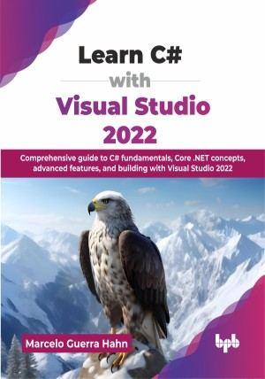

# Learn C# with Visual Studio 2022

Comprehensive guide to C# fundamentals, Core .NET concepts, advanced features, and building with Visual Studio 2022.

This is the repository for [Learn C# with Visual Studio 2022
](https://bpbonline.com/products/learn-c-with-visual-studio-2022?variant=44641656537288),published by BPB Publications.

## About the Book
C# and Visual Studio 2022 are foundational technologies for developing a wide range of applications on the .NET platform, from desktop to web. This book is your practical guide to mastering these tools, designed to take you from understanding the basics to building real-world solutions effectively.

This book starts with setting up the IDE, and covers core programming basics like syntax rules, variables, data types, operators, control structures (like if-else statements and loops), exception handling, and methods. You will learn essential object-oriented programming (OOP) concepts such as classes, objects, encapsulation, inheritance, polymorphism, and abstraction. Progressing beyond fundamentals, you will learn efficient data management with collections, generics, and LINQ, handling events using delegates and events, and data persistence via file and stream I/O. The journey continues with file and stream input/output operations, enhancing application responsiveness with asynchronous programming, and delving into advanced concepts like reflection and dynamic programming. Finally, you will gain hands-on experience in building user-friendly Windows desktop applications with Windows Forms and WPF, and creating modern web applications and services using ASP.NET Core and Blazor, including building interactive client-side web UIs with C#.

By mastering these skills, you will possess a solid understanding of C# and the capabilities of Visual Studio 2022 to tackle real-world programming challenges, develop robust, scalable, and maintainable solutions, enhancing job stability in the C# development market.

## What You Will Learn
• Write C# programs using Visual Studio 2022 effectively.

• Apply core OOP concepts in C#.

• Manage data structures and perform queries using collections and LINQ.

• Build desktop applications with Windows Forms and WPF frameworks.

• Develop modern web applications using ASP.NET Core and Blazor.

• Utilize advanced C# features like async, delegates, and reflection.

• Apply exception handling, debug C# applications using VS 2022 tools.

